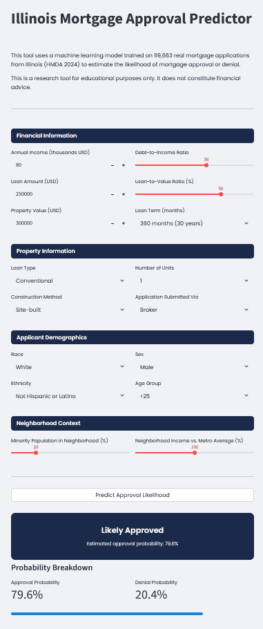

# Illinois Mortgage Lending Analysis — HMDA 2024


A data-driven investigation into mortgage lending patterns in Illinois,
using publicly available federal data to examine whether loan denials can
be fully explained by financial factors — or whether demographic
characteristics play a role they legally and ethically should not.

---

## Interactive App

This project includes a live prediction tool — the **Illinois Mortgage Approval Predictor**.
Enter applicant details and instantly receive an estimated approval or denial probability,
based on the XGBoost model trained on 119,663 real mortgage applications.



To run the app locally:

1. Clone this repository
2. Download the HMDA Illinois 2024 dataset from the
   [FFIEC HMDA Data Browser](https://ffiec.cfpb.gov/data-browser/)
   and save it as `state_IL.csv` in the project folder
3. Run the full notebook `GMDA_IL.ipynb` to train the model
4. Then start the app:

pip install -r requirements.txt
streamlit run app.py

---

## Background

Every year, US financial institutions are legally required to report
loan-level data on every mortgage application they receive under the
**Home Mortgage Disclosure Act (HMDA)**, enforced by the
**Consumer Financial Protection Bureau (CFPB)**. The data is public
by design — to allow regulators, researchers, and civil society to
examine whether lenders are fairly serving their communities.

This project analyzes 119,663 home purchase mortgage applications
from Illinois in 2024, sourced directly from the
[FFIEC HMDA Data Browser](https://ffiec.cfpb.gov/data-browser/).

---

## Research Question

> Who gets a mortgage in Illinois — and who doesn't?
> Can denials be fully explained by legitimate financial characteristics,
> or do demographic factors play a role they shouldn't?

---

## Project Structure

```
hmda-illinois-mortgage-analysis/
│
├── GMDA_IL.ipynb          # Main analysis notebook
├── app.py                 # Streamlit prediction app
├── requirements.txt       # Python dependencies
├── banner.png             # Project banner image
├── model/
│   ├── xgb_model.pkl      # Trained XGBoost model
│   ├── feature_names.pkl  # Feature list
│   ├── threshold.pkl      # Optimal decision threshold (0.688)
│   ├── median_values.pkl  # Median imputation values
│   └── scaler.pkl         # StandardScaler
└── plots/                 # All generated visualizations
```

Note: `state_IL.csv` is not included due to file size.
Download it directly from the [FFIEC HMDA Data Browser](https://ffiec.cfpb.gov/data-browser/)
(Illinois, 2024, All institutions).

---

## Methodology

### Data

- Source: FFIEC HMDA Data Browser, Illinois 2024
- Scope: Home purchase loans, first lien, owner-occupied, approved or denied
- Final dataset: 119,663 applications, 40 features

### Analysis Steps

1. **Exploratory Data Analysis** — financial features, fairness analysis,
   redlining indicators, loan type breakdown, denial reasons
2. **Machine Learning** — Logistic Regression, Decision Tree,
   Random Forest, XGBoost
3. **Threshold Tuning** — optimal decision threshold per model
   via Precision-Recall curve
4. **Feature Importance** — XGBoost gain-based importance
5. **Robustness Check** — model performance with and without
   the dominant predictor (`construction_method`)

### Best Model — XGBoost

| Metric | Score |
|--------|-------|
| ROC-AUC | 0.8235 |
| F1 (Denied) | 0.5085 |
| Precision (Denied) | 0.5549 |
| Recall (Denied) | 0.4692 |
| Decision Threshold | 0.688 |

---

## Key Findings

### 1. Financial strength matters — but does not tell the whole story

Approved applicants earn a median income of 102k/year vs. 71k for denied
applicants. However, key risk metrics like debt-to-income ratio (43 for both)
and loan-to-value ratio (90% for both) are virtually identical across groups —
suggesting financial risk alone does not drive denials.

### 2. Demographic disparities are large and consistent

- Black or African American applicants: 22.5% denial rate vs. 9.1% for White
- Hispanic or Latino applicants: 14.1% vs. 10.2% for Non-Hispanic
- Female applicants: 14.4% vs. 11.3% for male
- Applicants over 74: 14.1% vs. 9.4% for the 25-34 age group

### 3. Neighborhood composition predicts denial independently

Denial rates rise from 8.0% in predominantly white neighborhoods to 22.1%
in tracts that are 80-90% minority — a textbook signal of modern redlining,
consistent with recent CFPB enforcement findings.

### 4. Demographic features carry independent predictive power

The XGBoost model consistently ranks race among the top 5 most predictive
features — ahead of income, DTI, loan amount, and property value. This holds
across both model specifications (with and without `construction_method`),
confirming that demographic characteristics influence denial decisions
beyond what financial factors alone can explain.

### 5. Loan type amplifies existing disparities

FHA loans (designed for lower-income buyers) face a 16.3% denial rate,
and USDA loans 15.2% — both well above the overall average of 11.1%.
The programs intended to level the playing field are systematically
less effective in Illinois.

---

## Limitations

- HMDA data does not include credit scores, employment history, or asset
  documentation — key underwriting factors unavailable to us. This limits
  model performance and means we cannot fully rule out that unobserved
  financial differences explain part of the demographic gap.
- Correlation does not imply causation. Our findings are consistent with
  discriminatory lending but do not constitute legal proof of it.
- The model was trained on Illinois 2024 data and may not generalize to
  other states or time periods without retraining.
- In a real-world lending context, using race, ethnicity, sex, or age
  as model features is **illegal** under the Fair Housing Act and Equal
  Credit Opportunity Act. These features are included here solely for
  research purposes — to quantify their statistical impact and audit for bias.

---

## Tech Stack

- Python 3.11
- Pandas, NumPy
- Matplotlib, Seaborn
- Scikit-learn
- XGBoost
- Streamlit

---

## Data Source

Federal Financial Institutions Examination Council (FFIEC)
HMDA Data Browser — https://ffiec.cfpb.gov/data-browser/
Illinois, 2024, All reporting institutions

---

## Running the Model

The trained model files are not included in this repository due to file size.
To reproduce the model:

1. Download the dataset from the FFIEC HMDA Data Browser (Illinois, 2024)
2. Run the full notebook `GMDA_IL.ipynb`
3. The model files will be saved automatically in the `model/` folder
4. Then run `streamlit run app.py`

---

## Author

[azazzello451](https://github.com/azazzello451)
